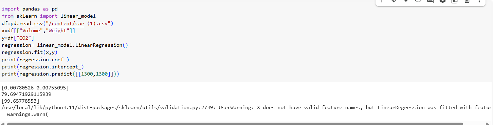

# Implementation of Multivariate Linear Regression
## Aim
To write a python program to implement multivariate linear regression and predict the output.
## Equipment’s required:
1.	Hardware – PCs
2.	Anaconda – Python 3.7 Installation / Moodle-Code Runner
## Algorithm:
### Step1
<br>Import necessary libraries (pandas for data handling and sklearn.linear_model for regression).

### Step2
<br>Load the dataset from the CSV file and extract input features (Volume, Weight) and the target variable (CO2).

### Step3
<br>Create and train the linear regression model using .fit(x, y).

### Step4
<br>Display the model’s coefficients and intercept to understand the relationship.

### Step5
<br>Use .predict() to estimate CO₂ emissions for given input values and print the result.

## Program:
```
import pandas as pd
from sklearn import linear_model
df=pd.read_csv("/content/car (1) (1).csv")
x=df[["Volume","Weight"]]
y=df["CO2"]
regression= linear_model.LinearRegression()
regression.fit(x,y)
print(regression.coef_)
print(regression.intercept_)
print(regression.predict([[1300,1300]]))

```

## Output


### Insert your output



## Result
Thus the multivariate linear regression is implemented and predicted the output using python program.